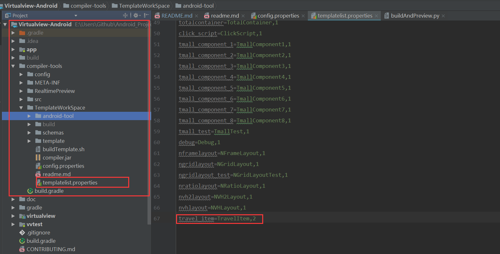
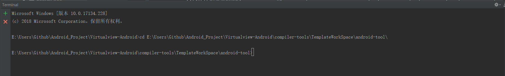
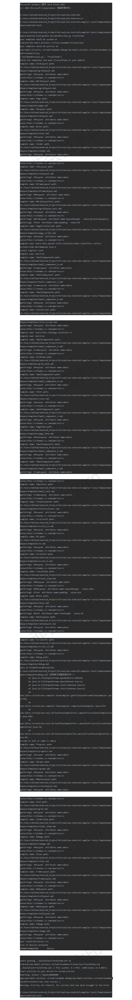
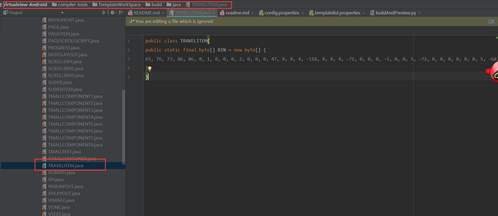
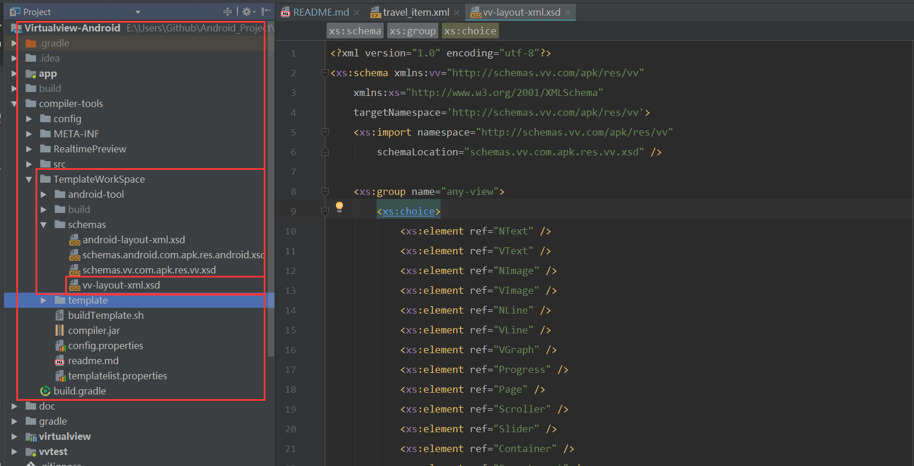
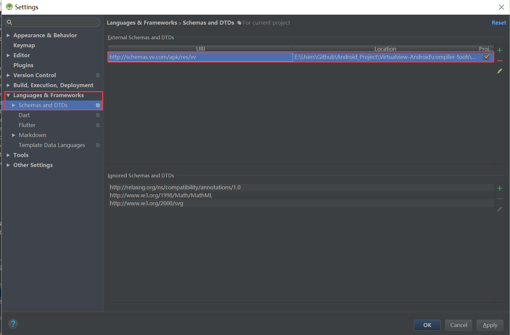
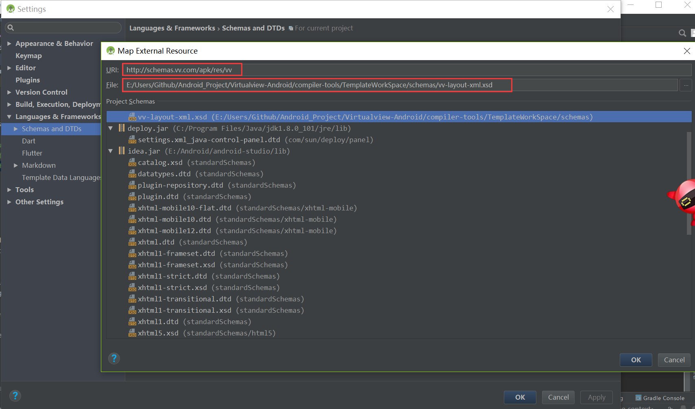
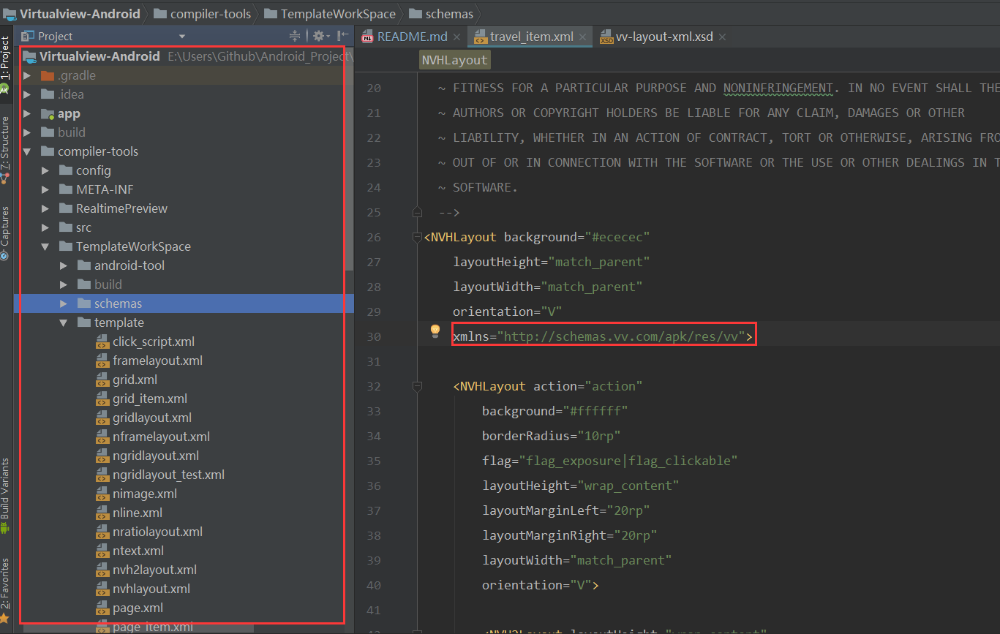

# VirtualView-Android -develop分支
##### 原项目地址：https://github.com/alibaba/Virtualview-Android

*该项目主要为生成Bin文件以及测试vlayout布局的效果*

#### 1.运行app模块，安装应用到测试机或者模拟器
#### 2.在项目该目录下：Virtualview-Android\compiler-tools\TemplateWorkSpace\template\travel_item.xml创建布局文件
#### 3.在项目该目录下：Virtualview-Android\compiler-tools\TemplateWorkSpace\templatelist.properties里面对travel_item.xml布局文件进行注册
#### 4.复制项目该目录下buildAndPreview.py文件目录地址粘贴到AndroidStudio的Terminal下：Virtualview-Android\compiler-tools\TemplateWorkSpace\android-tool\

<h6>步骤3截图：------------------------------------------------------步骤4截图：</h6>

#### 5.在AndroidStudio的Terminal里面输入python buildAndPreview.py TravelItem运行
#### 6.在手机上就可以看到刚才启动的APP出现的TravelItem的测试界面。
#### 7.在项目该目录下：Virtualview-Android\compiler-tools\TemplateWorkSpace\build\java\TRAVELITEM.java就可以看到生成的BIN类文件

<h6>步骤5截图：-------------------------------------------------------步骤6截图：--------------------------------------------步骤7截图：</h6>

> 关于在vlayout布局中使用xmlns属性(方便使用布局里的代码提醒功能)的说明：
*1.在项目的该目录下：Virtualview-Android\compiler-tools\TemplateWorkSpace\schemas\vv-layout-xml.xsd创建xsd文件，格式参考android.xsd
 2.在AndroidStudio配置xsd文件，并设置其uri
 3.在布局里面引用xsd文件使用xmlns规则
 4.在布局里面使用代码提示功能*

<h6>布局约束文件位置------------------------------------------------------AndroidStudio配置布局约束文件1</h6>

<h6>布局里面使用布局约束文件</h6>

